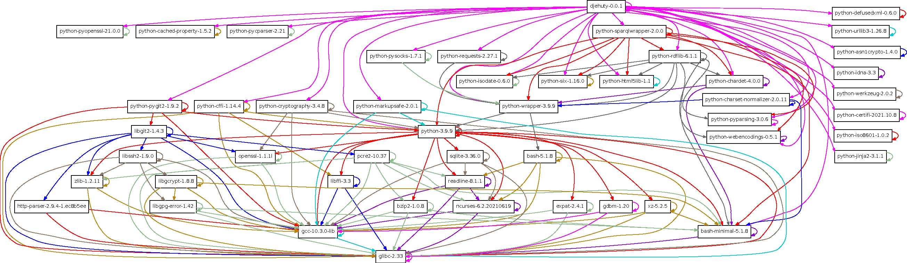

# Introduction

is the data repository system developed by and for 4TU.ResearchData. The
name finds its inspiration in
[Thoth](https://en.wikipedia.org/wiki/Thoth), the Egyptian entity that
introduced the idea of writing.

## Obtaining the source code

The source code can be downloaded at the
[Releases](https://github.com/4TUResearchData/djehuty/releases) [^1]
page. Make sure to download the djehuty-.tar.gz file.

Or, directly download the tarball using the command-line:

``` bash
curl -LO https://github.com/4TUResearchData/djehuty/releases/\(@*\\*@)download/v(@*\djehutyversion{}*@)/djehuty-(@*\djehutyversion{}*@).tar.gz
```

After obtaining the tarball, it can be unpacked using the t͡ar command:

``` bash
tar zxvf djehuty-(@*\djehutyversion{}*@).tar.gz
```

## Installing the prerequisites

The program needs Python (version 3.8 or higher) and Git to be
installed. Additionally, a couple of Python packages need to be
installed. The following sections describe installing the prerequisites
on various GNU/Linux distributions. To put the software in the context
of its environment:




The web service of stores its information in a SPARQL 1.1 endpoint. We
recommend either [Blazegraph](https://blazegraph.com/) [^2] or [Virtuoso
open-source edition](http://vos.openlinksw.com/owiki/wiki/VOS) [^3].

### Installation on Enterprise Linux 7+

The Python packages on Enterprise Linux version 7 or higher seem to be
too far out of date. So installing the prerequisites involves two steps.

The first step involves installing system-wide packages for Python and
Git.

``` bash
yum install python39 git
```

The second step involves using Python’s v͡env module to install the
Python packages in a virtual environment:

``` bash
python3.9 -m venv djehuty-env
. djehuty-env/bin/activate
cd /path/to/the/repository/checkout/root
pip install -r requirements.txt
```

## Installation instructions

After obtaining the source code (see section ) and installing the
required tools (see section ), building involves running the following
commands:

``` bash
cd djehuty-(@*\djehutyversion{}*@)
autoreconf -vif # Only needed if the "./configure" step does not work.
./configure
make
make install
```

To run the m͡ake install command, super user privileges may be required.
Specify a -͡-prefix to the c͡onfigure script to install the tools to a
user-writeable location to avoid needing super user privileges.

After installation, the d͡jehuty program will be available.

## Pre-built containers

4TU.ResearchData provides Docker container images as a convenience
service for each monthly d͡jehuty release. The following table outlines
the meaning of each image provided. The images are published to [Docker
Hub](https://hub.docker.com/r/4turesearchdata/djehuty) [^4].

|               |                                                                                                                                                                                                                             |
|:--------------|:----------------------------------------------------------------------------------------------------------------------------------------------------------------------------------------------------------------------------|
| **Image tag** | **Description**                                                                                                                                                                                                             |
| d͡evel         | Image meant for development purposes. Before it executes the d͡jehuty command it checks out the latest codebase. So re-running the same container image may result in running a different version of d͡jehuty.                |
| l͡atest        | This image points to the latest d͡jehuty release. It does not automatically update the d͡jehuty codebase.                                                                                                                     |
| X͡X.X          | 4TU.ResearchData releases a version each month where the number before the dot refers to the year and the number after the dot refers to the month. Use a specific version image when you want to upgrade at your own pace. |

To build the container images for yourself, see the build instructions
in the file.

[^1]: <https://github.com/4TUResearchData/djehuty/releases>

[^2]: https://blazegraph.com/

[^3]: http://vos.openlinksw.com/owiki/wiki/VOS

[^4]:
